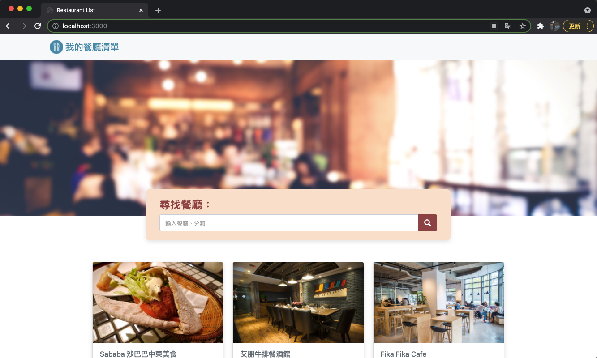
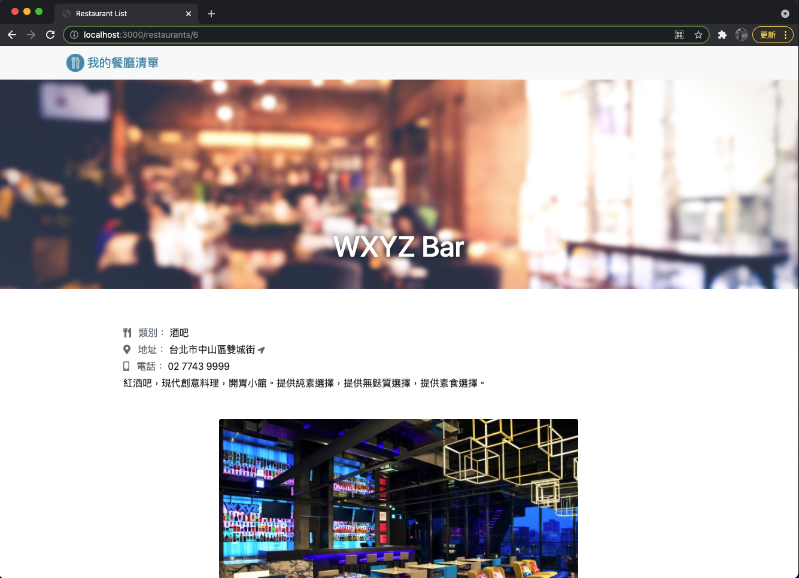
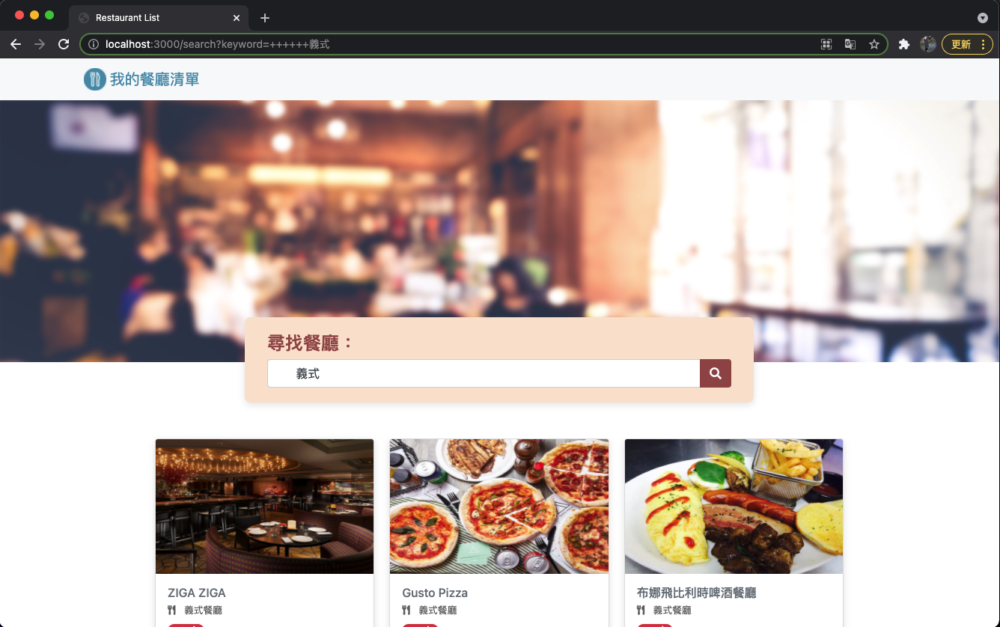
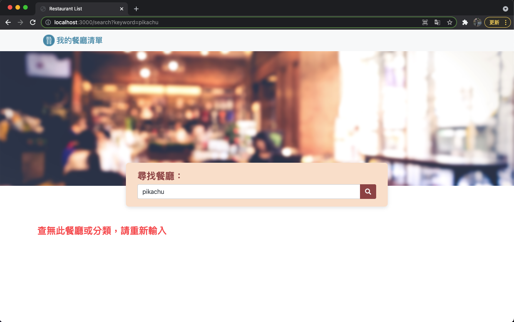

# restaurant-list
---
## What can this project do?
+ User can find 8 different restaurants on the main page.
+ User can click on any restaurant card, it'll show user that restaurant's informantion.
+ User can search restaurant keyword or category in the search bar.

---
## ScreenShots
* Main Page

* Show Page

* Searching Page

* Searching no result Page

---
## Install and Run the app.js
1. Use your Terminal and `git clone` this project.
```
git clone https://github.com/KUOCHIUHSIANG/restaurant-list
```

2. First-things
```
cd restaurant-list  // Enter the project directory
```
```
npm install  // Instal npm
```
```
npm install -g nodemon  // Instal nodemon 
```

3. Start-the-app.js
```
nodemon app.js
```
or
```
npm run dev
```

Finally, you will see `Express is listening on localhost:3000` on the Terminal.


Now, you can connect `"http://localhost:3000"` on your browser to see the Restaurant-List Website!


Notice,  Don't forget use `Control + C` to disconnect....  ;)
